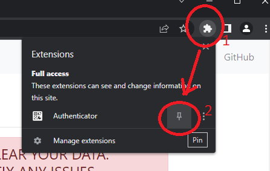
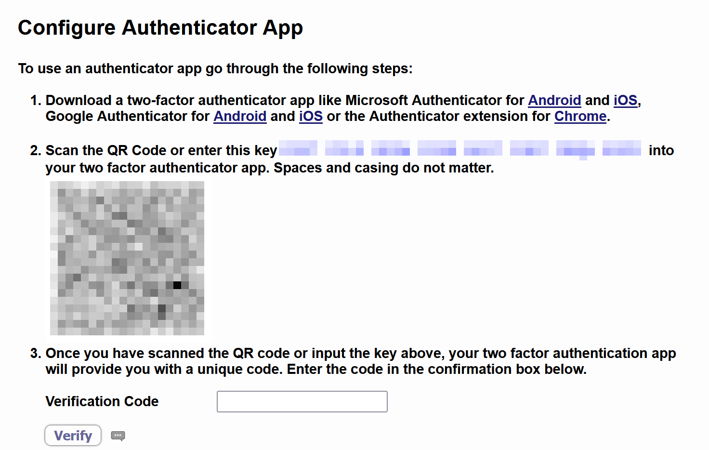
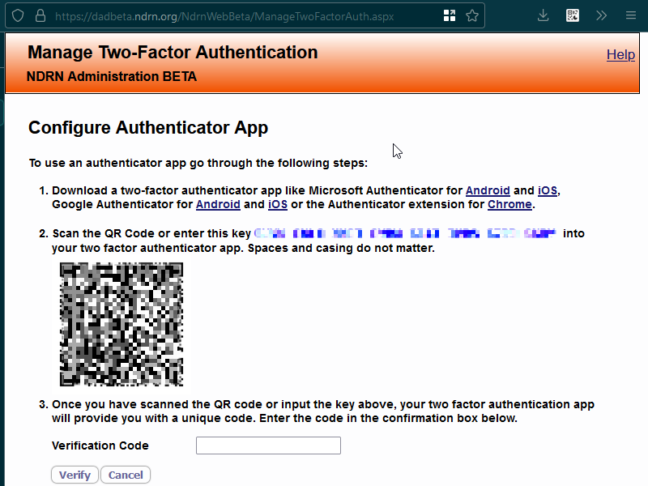

# Browser Authentication Setup

### Install an authenticaton app on your browser

Open the appropriate link and install:

[Authenticator extension for Chrome](https://chrome.google.com/webstore/detail/authenticator/bhghoamapcdpbohphigoooaddinpkbai?hl=en)

[Authenticator extension for Firefox](https://addons.mozilla.org/en-US/firefox/addon/auth-helper/)

[Authenticator extension for Edge](https://microsoftedge.microsoft.com/addons/detail/authenticator-2fa-client/ocglkepbibnalbgmbachknglpdipeoio)

You have a new icon on the bar in the upper-right corner of the browser. In Chrome (you are probably using chrome), the icon is hidden in a menu. To expose it, first click on the puzzle piece then in the exposed menu click on the pin icon.



Consider pinning the authenticator for ease of access

### Attempt to log in to DAD

Attempt to log in to [DAD](https://dad.ndrn.org). You should see a screen titled "Configure Authenticator App". The page should have a QR code (a square barcode thing) on it.


*This screenshot is for illustration purposes. You will get your code from the DAD website. You will not get it from this image it is only an example.*


### Use the authenticator to scan the QR code

Click on the authenticator icon. Then Click on the button below that looks like [-] to open the QR scanner. This opens a "click and drag to select" interface.

Click, drag, and release to select the QR code. Let go to confirm selection. You should see a confirmation message; click ok.
Demonstration of clicking, selecting, and releasing the QR code, using a 'padded' selection



*This is an animation demonstrating how to use the authenticator to scan the QR code*

```admonish
If you instead get an error: try it again with a larger / wider / padded selection. You want there to be a bit of blank space on the sides of the selection. For more on this see the Support section, heading Browser extension QR scanner says Unrecognized QR code.
```

```admonish
If you tried the instructions in the previous tip and it still isn't working: see the Support section, heading An alternative to scanning the QR code for instructions on what to try next.
```

If you open the authenticator you should now see an entry/"tile" for DAD containing a title, a six digit code, and a timer. Congratulations! You have set up your authenticator. Now all that's left is to use it.

```admonish
The "scan a QR code" step only has to be done during setup. During a typical login after setup, you don't need (and won't be shown) another QR code. You'll open your authenticator, get your current six-digit code, and give that to DAD and you'll be "in".
```

```admonish
What the QR code does is to tell your authenticator how to make the six-digit security code DAD is asking for. Once it knows how to do this, it doesn't need to be told how again.
```

### Enter a code from your new DAD authenticator entry into DAD to confirm that setup worked

Open your authenticator. In your authenticator, there will be a six digit code. This code changes about every thirty seconds. Enter the current code (no spaces, just digits) into the "Verification Code" field in DAD and click the "Verify" button. You should now be logged in; congratulations!


*The screen will look something like this.*

```admonish
Please don't delete the authenticator! You aren't going to need it especially often, but you do want it to be available. 
```