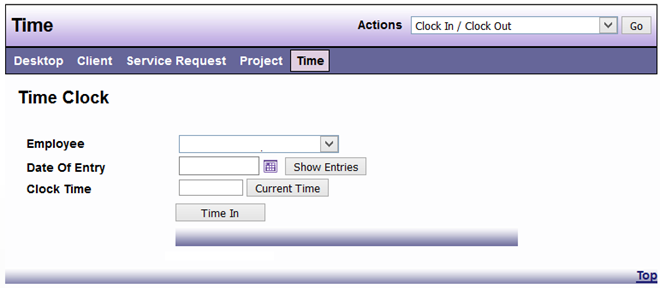

# Clocking In and Out for Non-Exempt Employees

Once a Non-Exempt Employee has logged into the DAD application and from the Desktop view select the Time main menu option, selecting the dropdown Action option “Clock In/Out”

1. Select the date

2. Clock in (remember to choose AM or PM)

3. Clock Out (remember to choose AM or PM)

