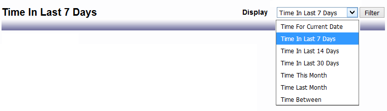
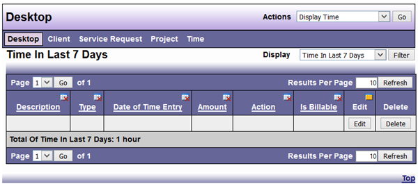
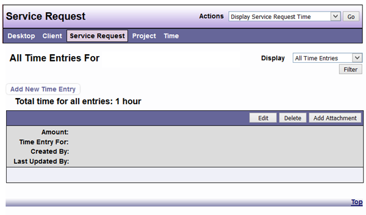
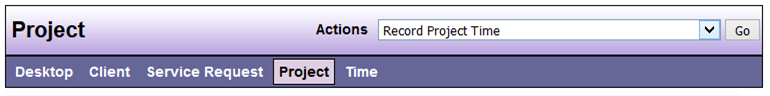
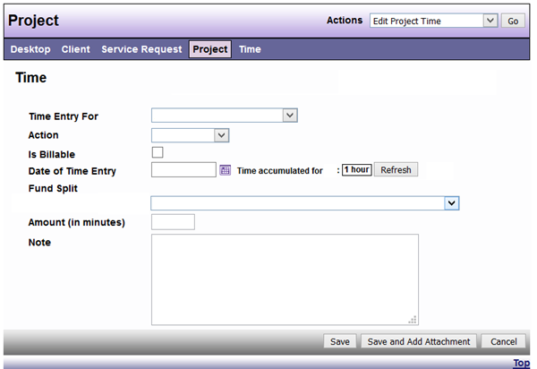

# Displaying/Checking Time

Daily time for the current date displayed on your Desktop through the User Preferences function. (see previous [User Preferences](https://dadbooktest.nyuu.page/display/index.html) section for more information)



Display Time from the Desktop Actions menu.



```admonish tip
*Once selected there Display Options (drop down) of “Time for Current Date”, “Time in the Last 7 Days”, “Time in the Last 14 Days”, “Time in the Last 30 Days”, “Time this Month”, “Time last Month”, or “Time Between”.*

Display time entries by selecting Display Service Request Time or Display Project Time from the Actions menu on a specific Service Request or Project Screen 

Service Request



Project




```