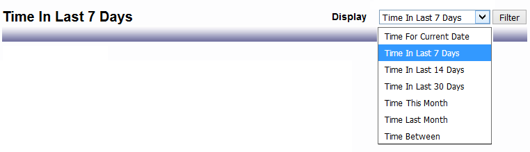
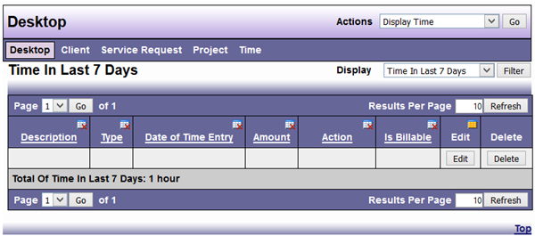

# Displaying/Checking Time

Daily time for the current date displayed on your Desktop through the User Preferences function. (see previous [User Preferences](https://dadbooktest.nyuu.page/display/index.html) section for more information)

Display Time from the Desktop Actions menu.

