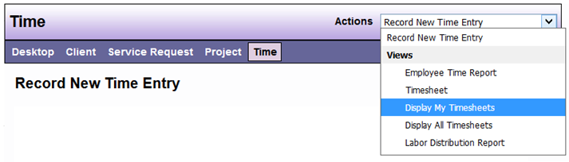
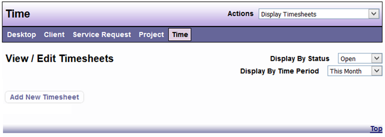
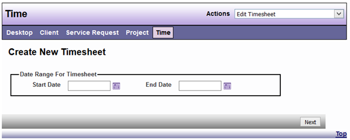
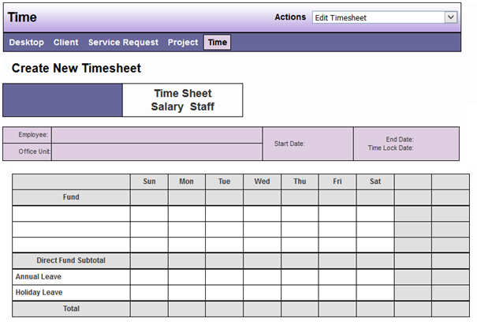
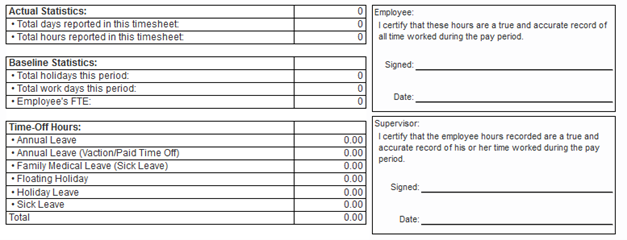
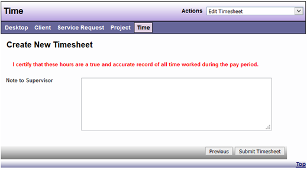
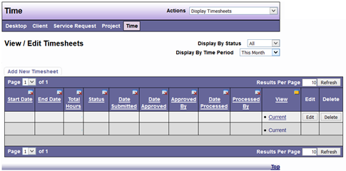

# Electronic Timesheets

Once an Employee has logged into the DAD application and from the Desktop view select the Time main menu option, selecting the dropdown Action option “Display My Timesheets” will start the submission of recorded time entries to a supervisor process:

 
From the Display My Timesheets view, Employees will select “Add New Timesheet”:

 
Employees will then be prompted to specify a start and end date for the timesheet to be submitted and upon selection of dates, select next:

The Timesheet will then be displayed based on the dates selected and the Employee will select either Next to continue or Previous to edit the dates:

Upon selecting next, the Employee will be prompted to submit any notes to the Supervisor that has been specified to review submitted timesheets for the employee and to select Submit Timesheet.  These notes will be included in the email notification to the Supervisor and will be included with the final timesheet as well (this feature will be added, currently notes are only included within the email notices).

The submitted timesheet will display with the grid of the Display My Timesheets view and time records made during that time period will be locked and no additional entries will be allowed during that time period.

 

Once the employee, designated as Supervisor for the Employee record that submits a timesheet, approves the timesheet, an email notification with any notes will be sent to the Employee and the Accounting Employee assigned to the Employee.  At that point the dates and employee that approves the timesheet will be updated.  This will repeat once the timesheet is approved for processing by the assigned accounting employee.  If at any review level by the supervisor or the accounting employee the timesheet is found to need edits, the email notification will be returned to the employee and the status will change from Submitted to Returned and the Employee will have the ability to edit time records during the time period of that time sheet and then select Edit from the Display My Timesheets view and resubmit the timesheet to be reviewed again.
