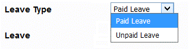
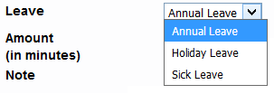
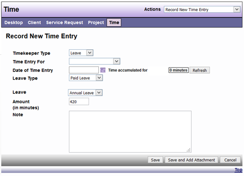

# How to Enter Leave Time

1.	Go to the time view from your DAD desktop or any other view

    *	The timekeeper type is Leave 

        
 
    *	The time entry for is set to your name 

2.	Enter the date for the time you are entering. The current date will be the default. The drop down provides you a calendar or you can type in the date (month/day/4 digit year)

    *	To the right of the date you will see the time you have in DAD for the date you choose 

3.	Choose the applicable leave type from the drop down menu 

    *	Paid (default) 

    *	Unpaid Leave

        
 
4.	Choose the Leave you are using from the drop down menu 

    *	If you choose Paid Leave, you have the option of holiday (default), sick, vacation, or other leave 

        
 
    *	If you chose unpaid Leave as the leave type, the leave will default to unpaid leave 

5.	Enter the amount of time 

6.	Enter a note 

7.	Click save to save your entry or cancel to not save your entry 

Sample: 

