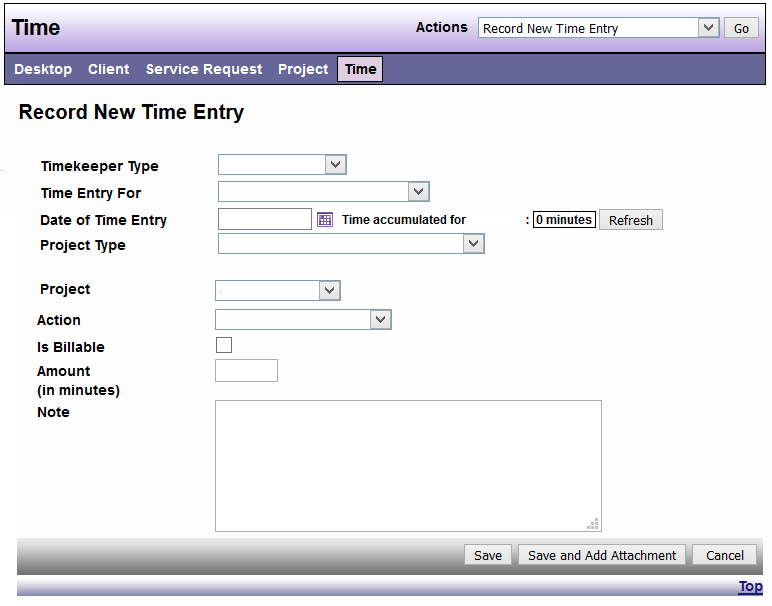

# Project Time

Steps

1. On the top of desktop click TIME

2. Choose the timekeeper type

3. Enter date of time entry

4. Choose project type

5. Choose project

6. Choose action

7. Enter your time

8. Enter notes

9. Click save

10. You will then be given the same screen to continue recording your time OR you may go to the actions drop down menu and select employee time report or timesheets