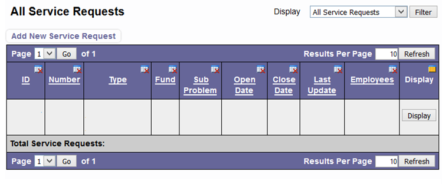
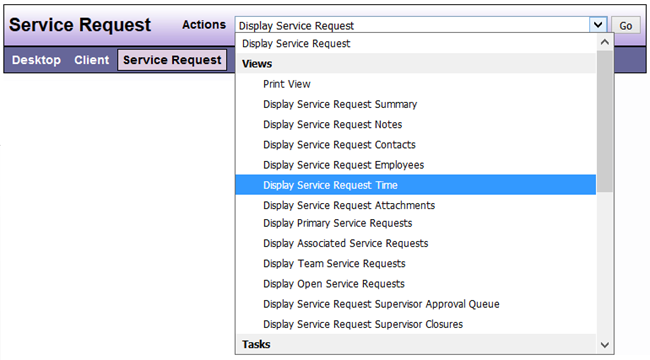
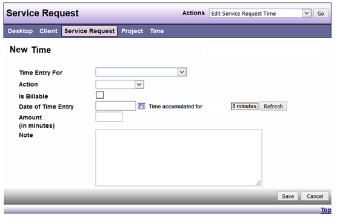

# Recording Service Request Time

1.	On the desktop search for the client by name or client id OR if you know the service request id number you can search for that in the basic service request ID search located on the desktop

2.	Click search

3.	Locate client (The search result display 10 clients per page)

4.	Click select next to client name

5.	Scroll down to all service requests

6.	Locate the correct service request

7.	Click display on the right hand side of the screen

8.	On the actions drop down menu find record service request time

9.	Click Go

10.	Choose the action that best describes what you did in this service request

11.	Change the date if necessary

12.	Enter your time 

13.	Enter notes

14.	Click save

