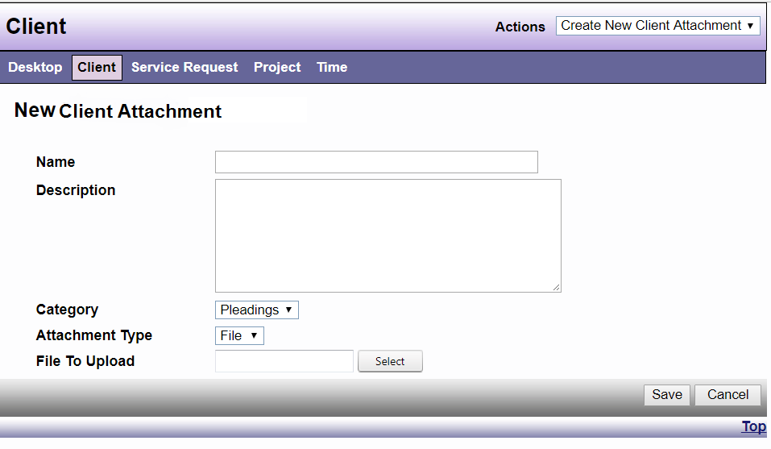

# Attachments

Within the DAD system there is the ability to add attachments as necessary. Attachments can be sorted by Category. The list of categories can be expanded locally by your DAD Administrator. Attachment Type gives you the option of selecting “File” or “Link” (a web URL or address).

*Note: File capacity is currently set at 500 megabytes.*

