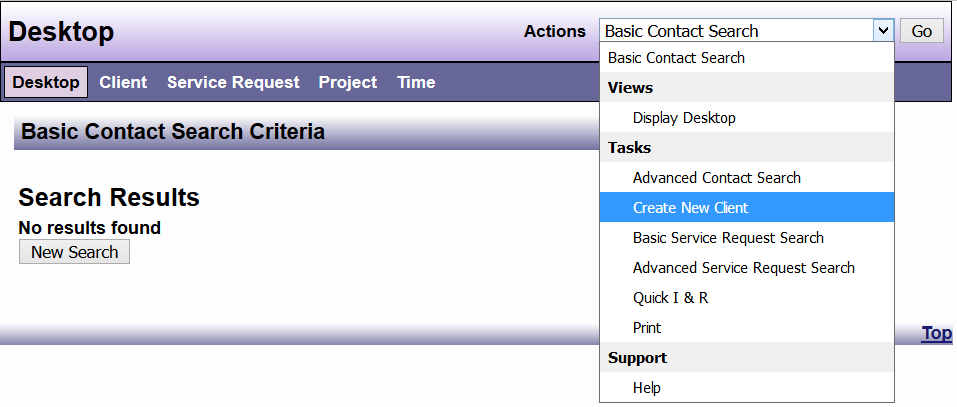
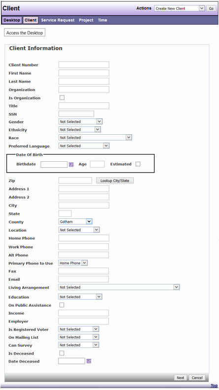

# Create New Client

The methodology for using the DAD application is that advocacy efforts from an agency for an *individual* are recorded as a Service Request associated with a Client. Agency activities on behalf of *groups of individuals* are recorded as Projects.  Projects are used to document efforts such as monitoring facilities, education and outreach activities, systems advocacy, and investigations involving a group of people. Projects can also be used to document administrative activities and time. 

Individuals are recorded in the system once as a contact and that contact has specified connections for the different recorded roles for that individual. A contact can be a Client, a primary contact, an adversary, or any other contact type that is specified in the Administration component of DAD. Regardless of how the contact is selected for editing, editing the contact information, such as the address or phone number, will update the contact’s information for each item it is connected to. There is no limit to how many connections a contact can have. 

If it has been established that the individual is not in the database, there is the ability to create a new client.



Any information entered into the Basic Contact Search Criteria will be automatically transferred to Client Information. 

```admonish note
DAD assigns a unique ID to new clients. This number is listed in the Client ID field for each client record. If the agency has another filing system in use, that information, can be entered under Client Number and used as a secondary ID.
```



```admonish tip
The phone fields are set so that additional information can be added i.e. 1234567890 ext 001 or 1234567890 (extra note) ask for "Mickey"
```