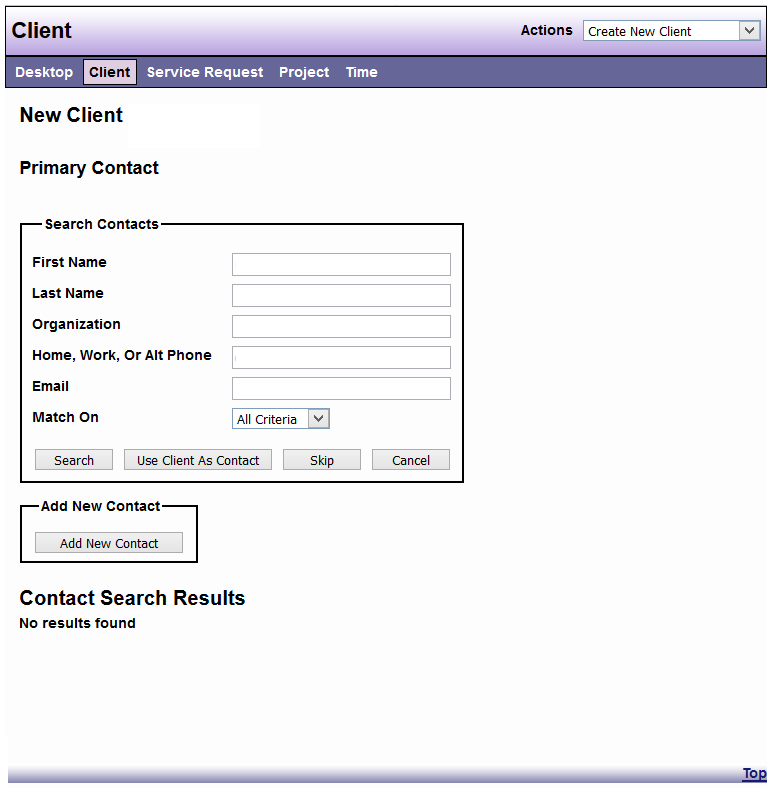
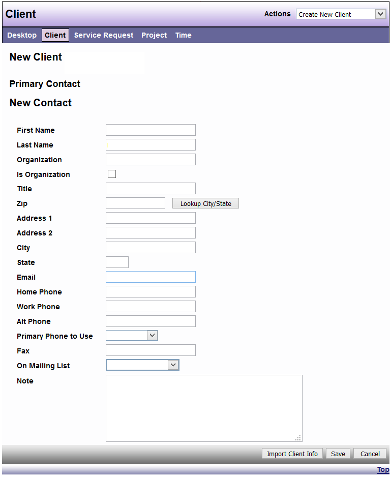
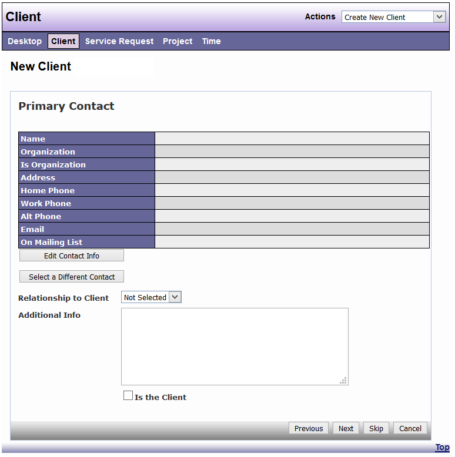
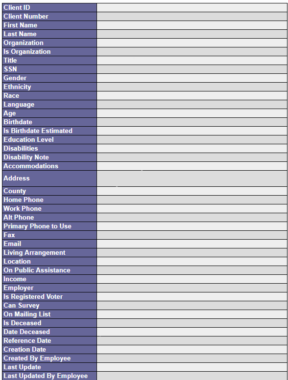

# Client Contacts

Primary Contact Field  

You can choose to ‘Use Client As Contact’ for the Primary Contact, if the client is his 
or her own Primary Contact or, you can complete a contact search for a different 
individual.  DAD will search the database for that person.  If the contact search results 
list the correct individual, you can select that record. Otherwise, you can select “Add 
New Contact”. 

Complete the following fields and select “Save” to create a New Contact.

After the Primary Contact is created, you can edit information if needed.  Choose the ’Relationship to Client’ from the drop-down menuif the client is not the Primary Contact. Enter any ‘Additional Info’ not already included. If you selected “Use Client as Contact”, to create the Primary Contact, “Is the Client” will be checked.

In a similar manner, with a subsequent screen, you will also have the opportunity to enter Guardian information. 
 
You must select “Finish” on the final screen to save and create the Client Record. This can be displayed in Summary or Detail View. Use the drop-down list in the “Actions” menu to switch to the preferred view.

Client Detail View (example)

