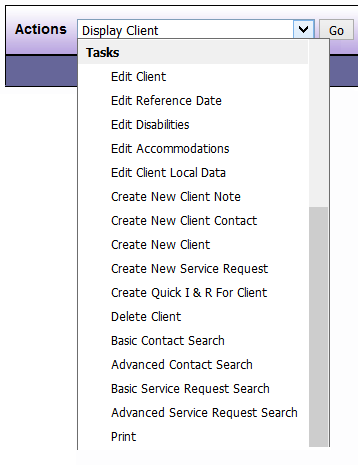

# Tasks

| Options | Feature Description |
|---------|---------------------|
| Edit Client | Enables you to edit many of the Client information fields such as address |
| Edit Reference Date | Enables you to edit the reference date for the Client |
| Edit Disabilities | Enables you to add or remove disabilities that the Client discloses |
| Edit Accommodations | Enables you to add/remove accommodations needed by the Client |
| Edit Client Local Data | Enables you to edit fields set up locally such as veteran status |
| Create New Client Note | Enables you to create a new note |
| Create New Client | Enables you to create a new Client record |
| Create New Service Request | Enables you to create a new Service Request for the Client |
| Create Quick I & R for Client | Enables you to create a quick I&R for the Client |
| Basic Contact Search | Allows you to perform a basic Contact search |
| Advanced Contact Search | Allows you to perform an advanced Contact search |
| Basic Service Request Search | Allows you to perform a basic Service Request search |
| Advanced Service Request Search | Allows you to perform a advances Service Request search |
| Print | Allows you to print the current screen |

*NOTE: You may not have all of these options depending on your DAD security level.*

