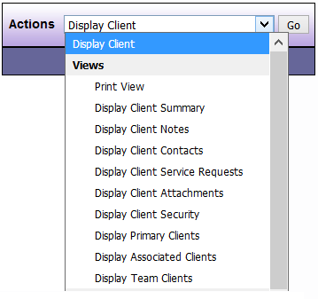

# Views

| Options | Feature Description |
|---------|---------------------|
| Print View | Displays all of the information entered in the Client record |
| Display Client Summary | Displays limited information about the Client |
| Display Client Detail | Displays detailed information about the Client |
| Display Client Notes | Displays all, or the last 5, 10, or 15 notes for the Client |
| Display Client Contacts | Displays all contacts connected to the Client |
| Display Service Requests | Displays a Service Request summary and gives you access to actions for creating and editing Service Requests |
| Display Client Security | Displays the DAD security groups with permission to view the Client |
| Display Primary Clients | Displays all, open, or closed Primary Clients assigned to the user depending on which option you choose from the drop down menu |
| Display Associated Clients | Displays all, open, or closed Associated Clients assigned to the user depending on which option you choose from the drop down menu |
| Display Team Clients | Displays all, open, or closed Team Clients assigned to the user |

*NOTE: When displaying Primary or Associated Service Requests, the last choice you make in the available drop down menu (all, open, or closed) is what will appear each time you are on your Desktop until you choose another option.*

