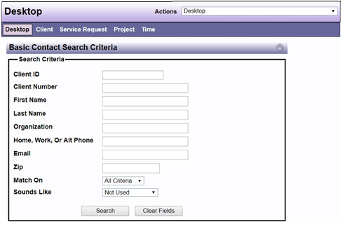

# Basic Contact Search Criteria

Whenever contact is made with a new individual or potential client the first step is to do a search to determine the individual has ever been entered in the system as a client, guardian, contact or advisory of a client, or in anyway has been previously connected to the agency. This step avoids entering an individual into the system more than once.

*Note: DAD doesn’t have the ability to check for potential conflicts of interest as part of its toolset.*

*Note: The same search logic exists for projects and service requests.*

**Advance Contact Search** can be accessed by your DAD Desktop dropdown menu and has many more options for search criteria.

*Note: If DAD contains contact records that match your search information, they will be displayed on a Search Results screen. From that screen, you can choose to view one of the listed contact records.  If the contact found matches your Client information, a new Service Request can then be created for the existing Client.  If the contact search did not find a match in the existing data base, you will need to create a new Client.*