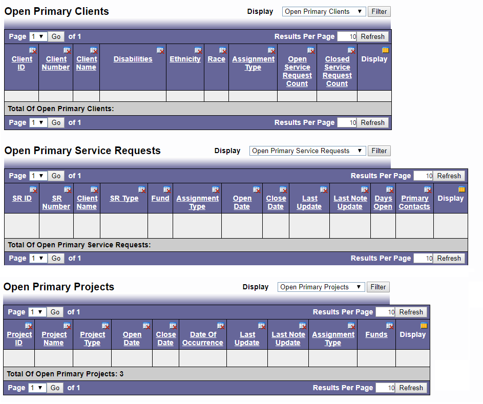

# Desktop Columns

Options exist to display the various column headings when viewing Primary and 
Associated Clients, Service Requests, and Projects.Left click on the blue and white 
charts with the red X in the right upper corner of the top of each column, to ‘hide’ that 
column. 

* Left click on the yellow and blue chart in the right upper corner of the top of the last column, to show all available columns. 

* The ability to sort by category (ascending and descending) and/or conduct compound searches exists.

```admonish tip
If you choose zero, it will show you all of the items.
```

**Sample View**:


