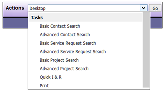

# Tasks

| Options | Feature Description |
|---------|---------------------|
| **Basic Contact Search** | Allows you to search for a Client or other contact entered in DAD using basic information such as Client ID, first or last name, organization, phone number, etc. |
| **Advanced Contact Search** | Allows you to search for a Client or other contact using any portion of the Client record, such as age, disability, or gender. |
| **Basic Service Request Search** | Allows you to search for a Client’s Service Request using basic information such as the Service Request ID, Client name, funding source, etc. |
| **Advanced Service Request Search** | Allows you to search for a Client’s Service Request using basic information such as that listed above as well as facility and Service Request Type |
| **Basic Project Search** | Allows you to search for Projects using basic information such as Project ID, or name, or funding source |
| **Advanced Project Search** | Allows you to search for Projects using basic information such as that listed above as well as Project closed date and Priorities and Objectives |
| **Quick I & R** | Allows you to quick search of I&R information |
| **Print** | Allows you to print the current screen |

```admonish note
The Contact, Service Request and Project search functions can also be shown on your DAD Desktop by selecting them in your User Preferences.
```

**Sample View**:

