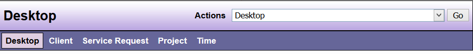

# Desktop Links

The links are available from the Desktop (and from every DAD screen). No matter where you are in DAD, you have access to the five (5) links that take you directly to one of the five (5) DAD views: 

| Options | Feature Description |
|---------|---------------------|
| Desktop | Always takes you back to your DAD Desktop |
| Client  | Displays the Client summary or detail screen (depending on where you are in DAD) of the Client whose Service Request you are viewing or the last Client that you viewed, if you are not in a Service Request. It also gives you access to actions for creating and editing Client records |
| Service Request | Displays the Service Request summary or detail screen (depending on where you are in DAD) for the last Service Request you viewed and gives you access to actions for creating and editing Service Requests |
| Project | Displays a Project detail screen for the last Project you viewed and gives you access to actions for creating and editing Projects |
| Time | Links you directly to a Time entry to be used for recording lunch and leave time. Also gives you access to the drop down for getting your timesheet and an employee time report that can be used to check time on a specific day. (see details later in this manual) |

```admonish tip
When using Links Buttons to move between Client and Service Request, use caution. When using the links, be sure you are indeed in the Client, Service Request or Project you want to be in before making any edits or entering any time or notes.
```

**Sample View**:

