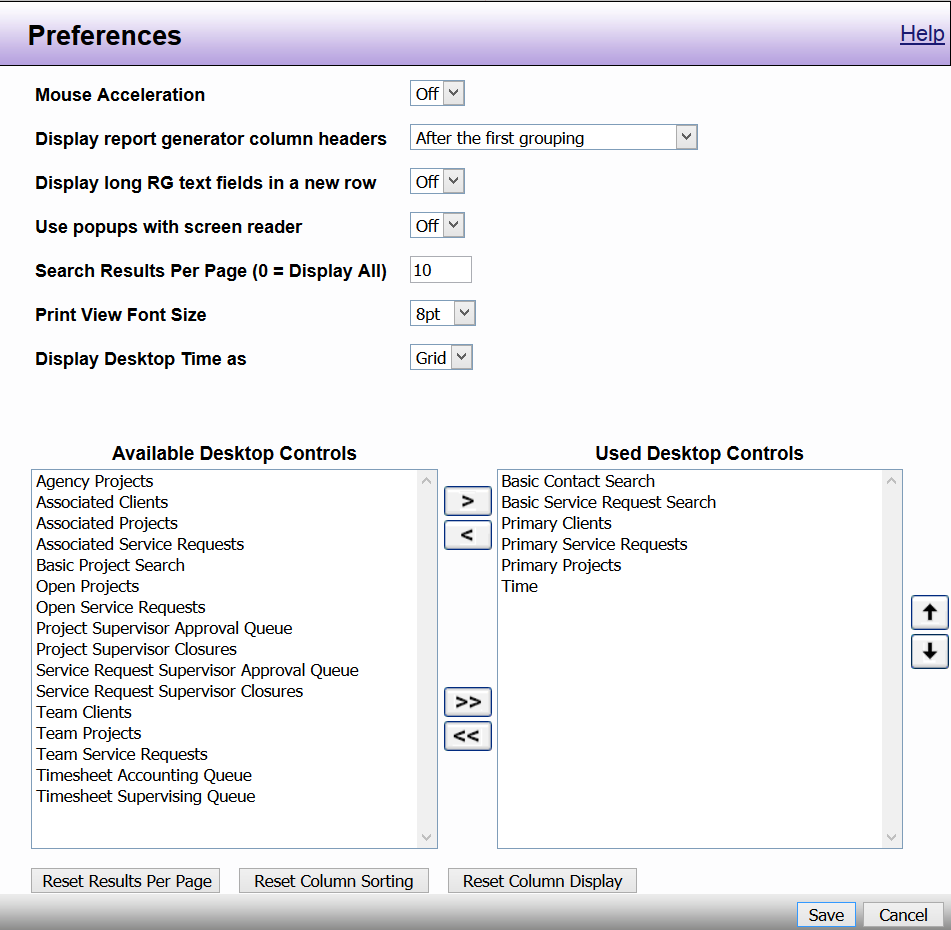

# Display/User Preferences

DAD is designed to be fully accessible and to enhance the accessible features of your preferred web browser. Using DAD's User Preferences function information can be set to the individual user’s preferences, they associate with your login.  

To change preferences, follow these steps:

1. Go to the **Control Panel**

2. Left click **User Preferences**

3. **Turn features on or off** and **change current settings** by clicking on drop down menu arrows 

4. **Change Desktop view** by selecting **Available Desktop Controls** and clicking on **right facing arrow** to move them over to **Used Desktop Controls** and vice versa 

5. **Sort Used Desktop Controls** by clicking on **up or down arrows** to change order of how controls appear on your desktop 

6. **Change Password** by clicking on **Change Password** button 

7. Click **Save**; or to close the window without saving your changes, click **Cancel** 

8. A pop-up will appear to let you know changes have been made. Click **Done** to return to the control panel.

*Note: Depending on your DAD security permissions, you may not see all of the options shown.*

