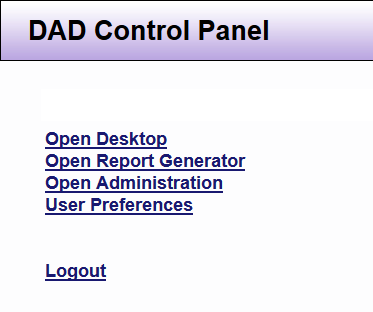

# DAD Control Panel

The DAD Control Panel is the main window from which you can launch DAD or select other controls that support your use of DAD.

 
The DAD Control Panel will reopen be open whenever DAD is running. It can be minimized or “hidden” behind other windows. Closing window will end the DAD session. 

*NOTE: Controls panel options vary based on the user’s permission status*

| Options | Feature Description |
|---------|---------------------|
| **Open Desktop** | Launches DAD, which enables you to enter information about your Clients, Service Requests, Time Entry and Projects |
| **Open Report Generator** | Launches the Report Generator, which enables users with permissions with access to create and view reports |
| **Open Administration** | Launches an Administration window, which enables users with advanced permissions to update and maintain DAD locally. |
| **User Preferences** | Lets you modify the behavior of DAD (for example, you can choose what information is displayed on the Desktop) |
| **Logout** | Closes DAD and any open application or support windows |

*NOTE: The DAD system does have a timeout feature. The feature is set to 6 hours. Do not rely on the timeout feature. Please remember to logout.*