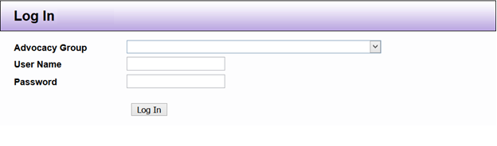

# Logging into DAD

Link to DAD login screen: [https://dad.ndrn.org](https://dad.ndrn.org)

The first time that you login to dad.ndrn.org the “Advocacy Group” will appear alphabetically. Once you choose your agency group, DAD will remember your group. Your DAD User Name and Password are assigned you by your DAD Administrator.

* User Name is NOT case sensitive
* Password is case sensitive
* Please ***DO NOT*** allow your computer to remember your password for security reasons
* Passwords can be changed at any time as needed. If your password security is compromised, stolen, etc. contact your DAD Administrator.
* After your information is entered into the fields, left click Log In or hit `enter`.
* Remember to log off at the end of each day by either closing or left clicking `Logout` from your control panel (explained on the next page).

It is recommended that after you receive your original temporary password that you
select “Change Password” to create your own personal password. If you forget your
person password you administrator has the ability to issue you a temporary password.

*NOTE: DAD has multiple security level capabilities. Contact your DAD Administrator for
details.*