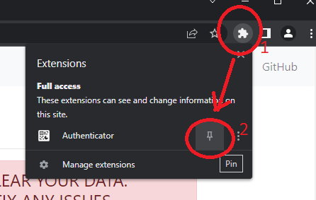
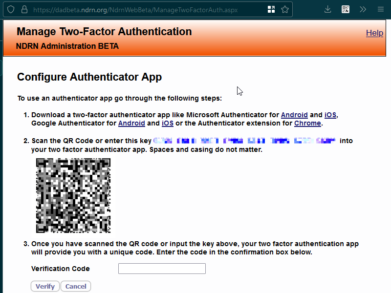
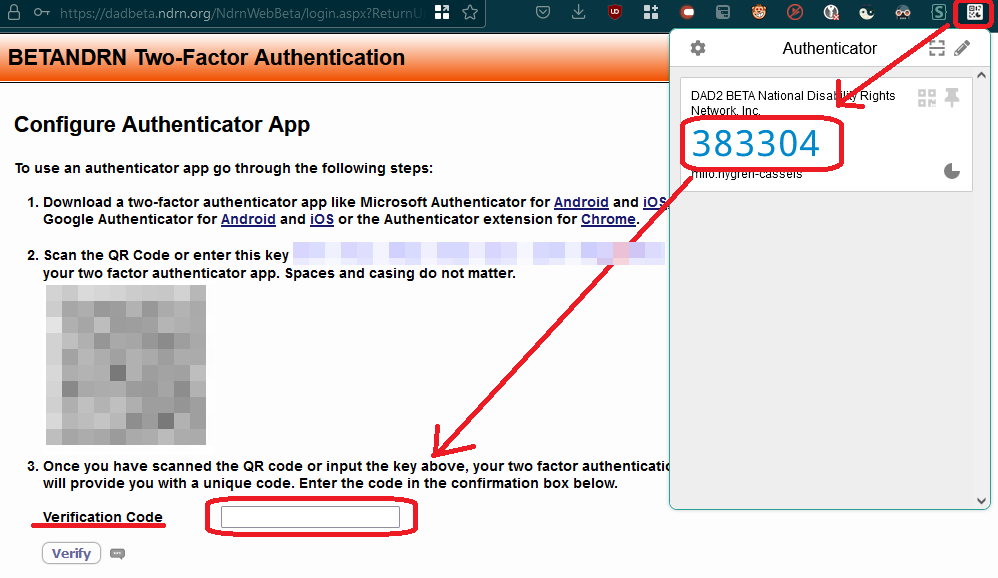

# Browser Authentication Setup

### Install an authenticaton app on your browser

Open the appropriate link and install:

[Authenticator extension for Chrome](https://chrome.google.com/webstore/detail/authenticator/bhghoamapcdpbohphigoooaddinpkbai?hl=en)

[Authenticator extension for Firefox](https://addons.mozilla.org/en-US/firefox/addon/auth-helper/)

[Authenticator extension for Edge](https://microsoftedge.microsoft.com/addons/detail/authenticator-2fa-client/ocglkepbibnalbgmbachknglpdipeoio)

You have a new icon on the bar in the upper-right corner of the browser. In Chrome (you are probably using chrome), the icon is hidden in a menu. To expose it, first click on the puzzle piece then in the exposed menu click on the authenticator's logo or name to launch it.

```admonish tip
Consider pinning the authenticator for more convenient access. To do this: open the puzzle-piece menu again, and click on the "pin".


```

### Attempt to log in to DAD

Attempt to log in to DAD. You should be on a screen titled "Configure Authenticator App". The page should have a QR code (a square barcode thing) on it and a CHALLENGE PHRASE (blue password-like text) above it.


*This screenshot is for illustration purposes. You will get your code from the DAD website. You will not get it from this image it is only an example.*

### Use the authenticator to scan the QR code

```admonish info
This section describes the "scan the QR code" approach to creating the entry. If you would like to instead use the CHALLENGE PHRASE method, see alternate instructions [here](http://dadbooktest.nyuu.page/login/2fa/support.html#an-alternative-to-scanning-the-qr-code)
```

Click on the authenticator icon. Then click on the button below that looks like [-] to open the QR scanner. This opens a "click and drag to select" interface.

Click, drag, and release to select the QR code. Let go to confirm selection. You should see a confirmation message; click ok.



*This is an animation demonstrating how to use the authenticator to scan the QR code*

```admonish
If you instead get an error: try it again with a larger / wider / padded selection. You want there to be a bit of blank space on the sides of the selection. For more on this see the relevant support section, [Browser extension QR scanner says Unrecognized QR code](http://dadbooktest.nyuu.page/login/2fa/support.html#browser-extension-qr-scanner-says-unrecognized-qr-code).
If it still isn't working: try the CHALLENGE PHRASE method instead.
```

If you open the authenticator you should now see an entry/"tile" for DAD containing a title, a six digit code, and a timer. Congratulations! You have set up your authenticator. Now all that's left is to use it.

### Enter a code from your new DAD authenticator entry into DAD to confirm that setup worked

Open your authenticator. In your authenticator, there will be a six digit code. This code changes about every thirty seconds. Enter the current code (no spaces, just digits) into the "Verification Code" field in DAD and click the "Verify" button. You should now be logged in; congratulations!



*The screen will look something like this.*

```admonish
Please don't delete the authenticator! You aren't going to need it especially often, but you do want it to be available. 
```