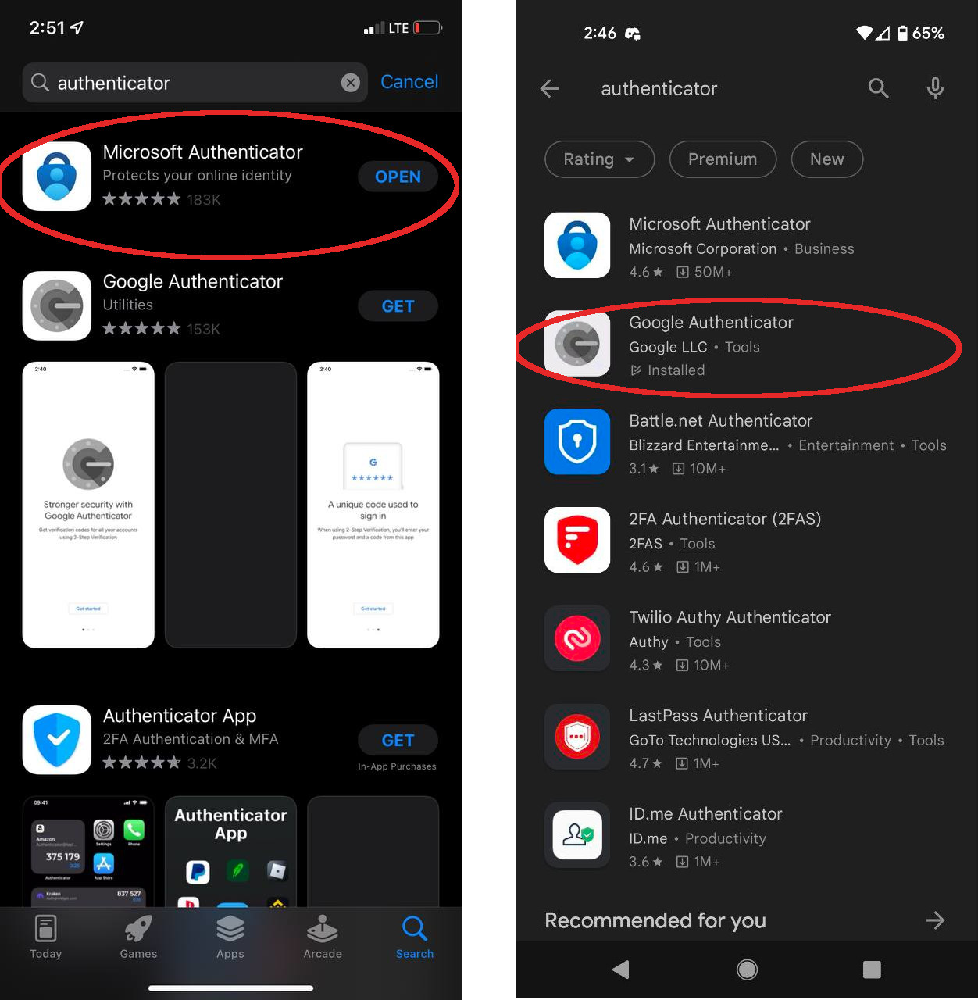
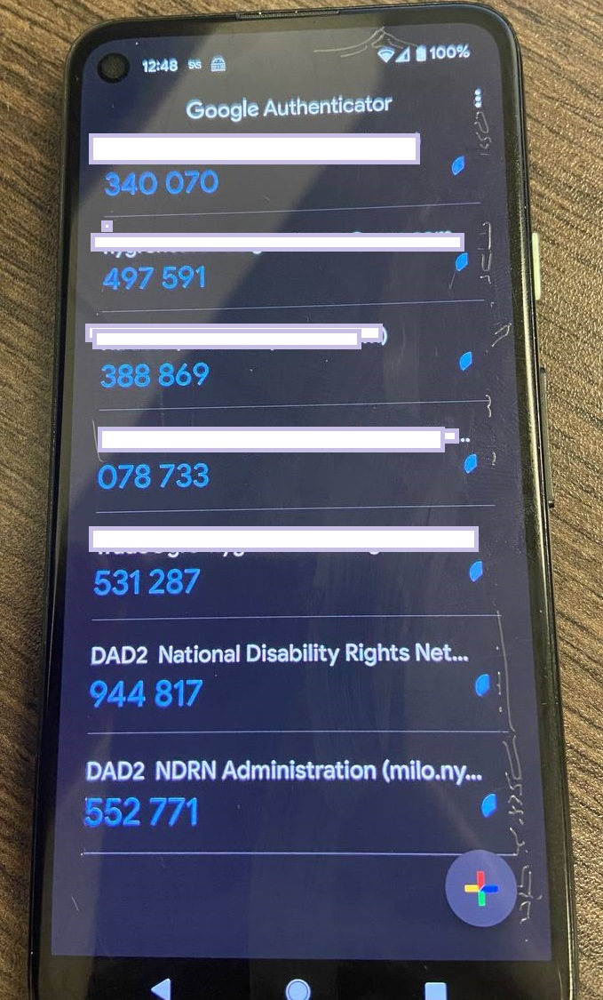
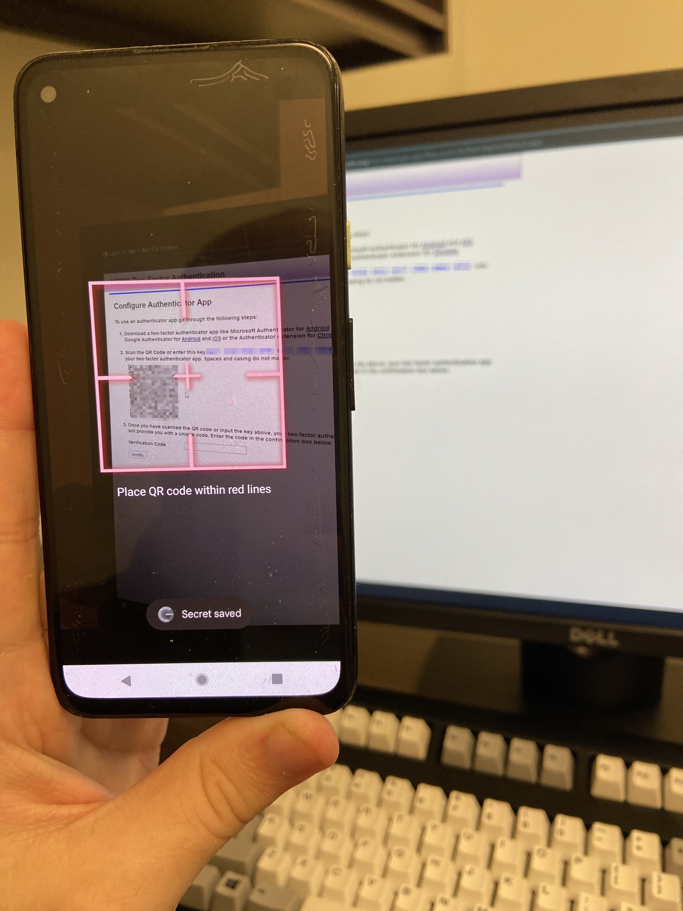

# Phone Authentication Setup

## On your phone...

### Install an authenticator app on your phone

```admonish
This section contains screenshots. Each image shows how to do the step on iOS and on Android. The image on the left is iOS and the right is Android. 
```

#### Find and open your phone's app store

Your phone has an "app store". On android, the app store app is named “play store”. On ios, it is named “app store”. Open your app store. 


*Find and open your phone's app store.*

#### Search for "authenticator", pick one, install it

In the search bar, search for “authenticator”. Select one from a major software publisher and install it.

```admonish note "Suggestion"
NDRN suggests picking Google Authenticator. Microsoft Authenticator would work also.
```



*Pick one of the search results*

In the search result, select an authenticator to be taken to its info page. Select "get" or "install" to download it and wait for it to install.

Once the authenticator installs, try running it. If you just installed your authenticator then it will have no entries yet. It should look something like this.



*Example screenshot of an authenticator containing a DAD entry (and also anonymized entries for other services)*

```admonish warning
The above screenshot contains examples of authenticator codes. Your codes will be different. Use the codes generated for you by *your* authenticator.
```

## On your computer...

### Attempt to log in to DAD

Attempt to log in to DAD. You should be on a screen titled "Configure Authenticator App". The page should have a QR code (a square barcode thing) on it and a CHALLENGE PHRASE (blue password-like text) above it.


*This screenshot is for illustration purposes. You will get your code from the DAD website. You will not get it from this image it is only an example.*

You will use the QR code or the password to teach the authenticator how to make the codes DAD wants.

## On your phone...

```admonish info
This section describes the "scan the QR code" approach to creating the entry. If you would like to instead use the CHALLENGE PHRASE method, see alternate instructions [here](http://dadbooktest.nyuu.page/login/2fa/support.html#an-alternative-to-scanning-the-qr-code)
```

### Use the authenticator to scan the QR code

In the authenticator app, tap the plus sign (+). Choose "Scan a QR code". This will launch a camera. Point it at the QR code shown in DAD. The authenticator camera should automatically take the information it needs, close the camera, and place you back at the authenticator's main screen with a new authenticator entry listed for DAD. Congratulations! You have set up your authenticator. Now all that's left is to use it. 



*Point camera at the QR code in DAD*

```admonish info "Clarification"
The "scan a QR code" step only has to be done during setup. During a typical login after setup, you don't need (and won't be shown) another QR code. If prompted for a code, you'll open your authenticator, get your current six-digit code, and give that to DAD and you'll be "in".
```

## On your computer, using code from your phone...

### Enter a code from your new DAD authenticator entry into DAD to confirm that setup worked

In your authenticator, there will be a six digit code. This code changes about every thirty seconds. Enter the current code (no spaces, just digits) into the "Verification Code" field in DAD and click the "Verify" button. You should now be logged in; congratulations! 

```admonish danger "Don't delete the authenticator"
Don't delete the authenticator. You aren't going to need it especially often, but you will need it.
```