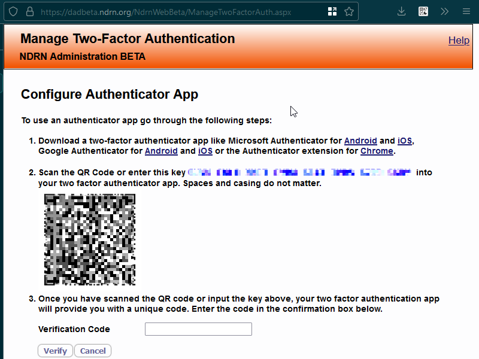

# Support

## Browser extension QR scanner says Unrecognized QR code

When using the scanner to select the QR code: leave a little bit of empty/blank/white space between the boundary of the selection and the edges of the code. In other words make the selection "bigger" than it looks like it needs to be.

The scanner consistently recognizes the code when the selection is "padded" and fails to recognize when the selection is "snug". Try it a few times. Below is an animated demonstration:



*Make the selection you draw be as padded as possible.*

```admonish
If you can think of a better explanation for how to do this: please contact [milo.nygren-cassels@ndrn.org]() with your idea.
```

## Authenticating on more devices

The verification codes generated by your authenticator will work on any computer. They are tied to your DAD account, not to a specific computer.

If you succeeded in setting up your 2fa before, and then you tried to access dad on another computer and you weren't shown a QR code this time: that's fine! That's the intended behavior, not a bug. Go to wherever you originally set up your authenticator and get a code from there. It will work here.

```admonish
Those who opted to use the browser extension might find the above instruction inconvenient.
Unfortunately: you will need to do this in order to log in on another computer.
Fortunately: once you have gotten yourself logged in, you can avoid having to do it again, by adding an authenticator entry on the new computer, which you can use to get your verification code when DAD next asks for one. The next heading, Copy my authenticator entry onto another device, explains how to do this.
```

## Copy my authenticator entry onto another device

The steps involved in this are:

* Log in to DAD on the device
  
    * See preceding heading Authenticating on more devices

* Install an authenticator on the device

* In DAD, access your QR code. To do this:
    
    1. Go to User Preferences.
    
    2. From there, go to Two Factor Authentication.
    
    3. From there, go to Setup Authenticator App.

* Use authenticator you installed to scan the QR code

```admonish
The verification codes generated by your authenticator will work on any computer. So: only reason you would do this is if you expect you might want to log in, in a context where you don't have access to the authenticator you set up previously.
```

## An alternative to scanning the QR code

Attempt to log in to DAD. You should see a screen titled "Configure Authenticator App". The page should have a QR code (a square barcode thing) on it.


*The screen will look something like this*

Directly above the QR code, there is a line that begins scan the qr code or enter this key followed by a long, blue-colored sequence of numbers and letters. I'm going to refer to that blue text as the challenge phrase.


*This is the part of the screen you're looking for*

Select the and copy the challenge phrase. Now open your authenticator. Then, click the ✏️ ("pencil") icon. Then, click the ➕ ("plus") icon. Then, click manual entry.

You should see two text fields: issuer and secret.

In the issuer field, write anything you want. It's a descriptor for your reference.

```admonish tip
We'd suggest putting the username of the account in the issuer field. It might be helpful if you ever need support and it definitely will be helpful for keeping things clear if you use multiple DAD accounts.
```

In the secret field, paste the challenge phrase.

Now, click "ok". If you open your authenticator again, there should now be a new entry!

## I no longer have access to my authenticator

Have your local DAD administrator reset your 2fa settings. They can do this in the same way that they can reset passwords. Have them log in on an account with admin powers, then go to Open Administration, then go to the Employees dropdown, then go to the Employees menu option. They should now be at a table listing all the users. The last column of this table, Reset 2fa, will allow them to reset your 2fa settings.

Then, follow the steps in the Phone Authentication Setup or Browser Authentication Setup section of this guide.

## The codes my authenticator is making don't work

```admonish bug
The most likely cause of the issue is "using an example QR code from a guide rather than from using the DAD website". The second most likely cause is "using qr code & authenticator entry & verification codes from the DAD BETA site". Regardless of cause, there is a fix that should work in all cases.
```

Have your local DAD administrator reset your 2fa settings. They can do this in the same way that they can reset passwords. Have them log in on an account with admin powers, then go to Open Administration, then go to the Employees dropdown, then go to the Employees menu option. They should now be at a table listing all the users. The last column of this table, Reset 2fa, will allow them to reset your 2fa settings.

Then, follow the steps in the Phone Authentication Setup or Browser Authentication Setup section of this guide, starting from the subsection Attempt to log in to DAD.

## I have another issue

Contact [milo.nygren-cassels@ndrn.org](MAILTO:milo.nygren-cassels@ndrn.org) with any questions or suggestions.