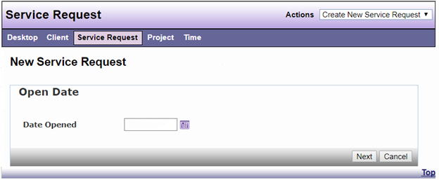
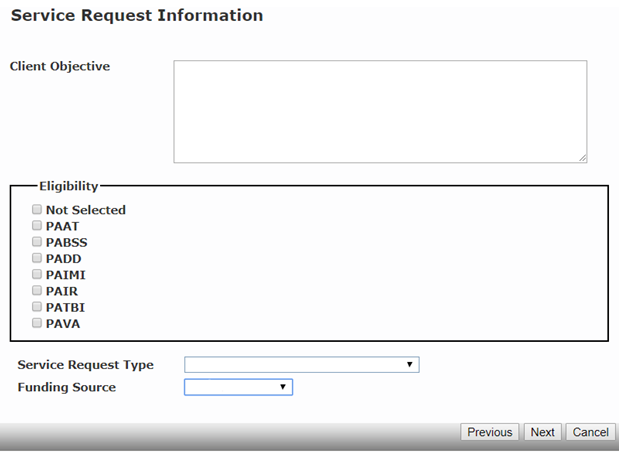
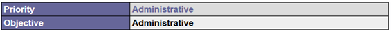
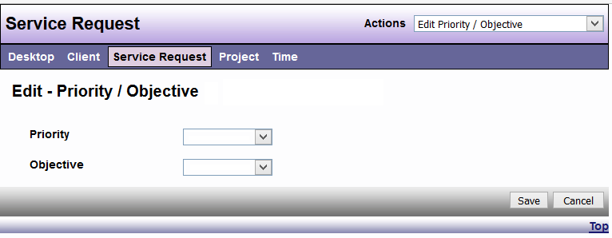
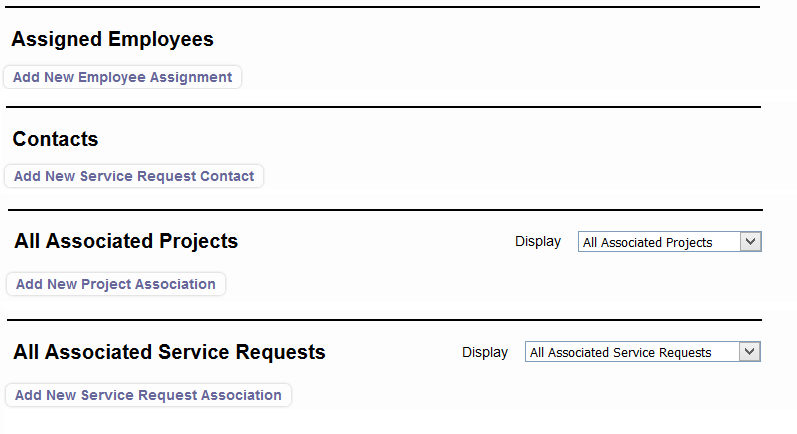
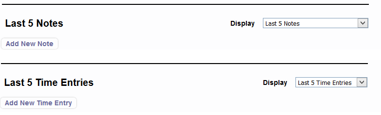
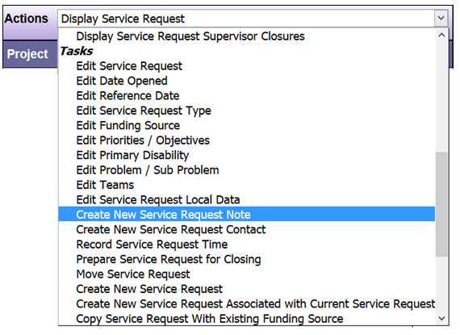
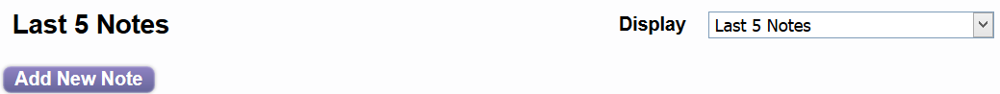

# New Service Request

Select Create New Service Request from the “Actions” menu. 



The date the Service Request is opened may trigger a change in available options for certain fields and/or differing local data questions based on the service year.

The initial screen in creating a new Service Request asks for the following information.



```admonish note
Eligibility, Service Request Type and Funding Source options maybe include local data and differ from what is shown.
```

Additional screens will allow you to enter additional information.  Some information will be imported from the client record and this can be edited for accuracy.  Additional fields maybe be required to complete a service request and selected options may need to fall within certain parameters, as determined by your agency. Omissions and errors will be indicated via red “Warnings Found”. 


Select “Finish” to save the Service Request.  The Service Request can be displayed in Summary or Detail View. Use the drop-down list in the “Actions” menu to switch to the preferred view. 

Fields within a Service Request Detail view can be edited by clicking on the response and making edits.









You have the ability to the add notes or creates notes via Actions > Tasks  



And/or clicking on the field in the Service Request View

