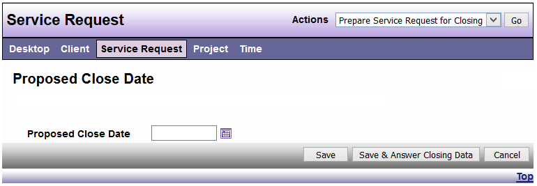
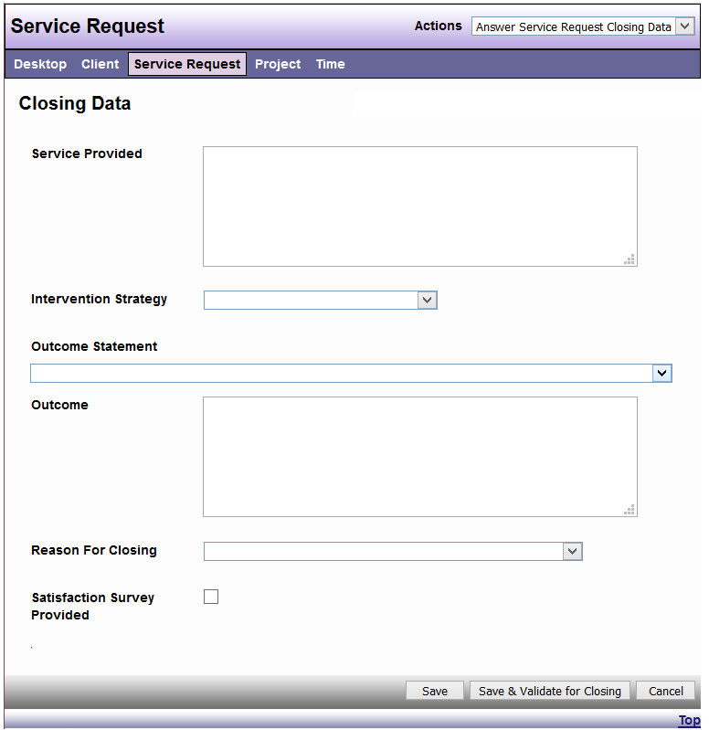

# Close a Service Request

There are three steps that must be complete before a Project is closed in DAD: 

Step 1: Choose Prepare Project for Closings from Actions menu.

Step 2: Enter a proposed close date, then click “Save & Answer Closing Data

*NOTE: If the Service Request has been closed then re-opened, or if you have prepared the Service Request for closure and did not receive approval until a later date, you MUST edit the proposed closed date to the date you are actually closing it.*

Step 3: Complete the required Fields (including required local data fields)

