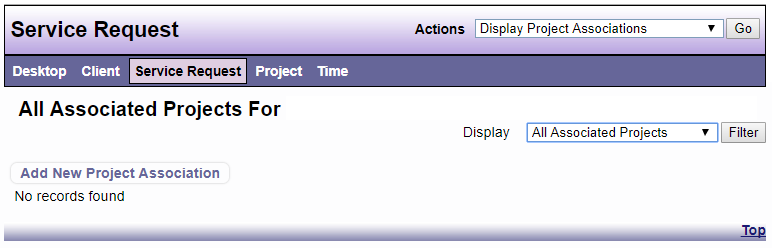

# Link Service Request to Projects

*NOTE: You must first have the Project ID for the Project you want to link to the Service Request.*

1. From the Actions/Tasks drop down on the Service Request view, choose Display Project Associations. 

2. From the Actions/Tasks drop down menu on the Display Project Associations view, choose New Project Association. 

3. Enter the Project ID for the Project you want to link to the Service Request, then click Check Project ID. 

4. If the correct Project name appears, click Save. If it is not the correct Project name, click Cancel and check that you have the correct Project ID then repeat steps 1 through 4

You may also add a Project Association by clicking on the link in the Service Request View.

