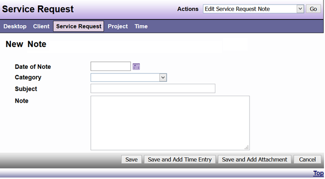
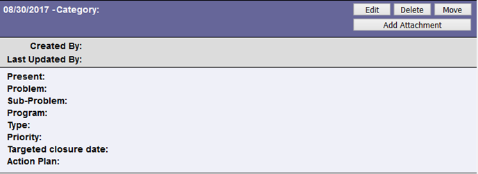

# Notes

DAD lets you create, edit, and delete notes about Clients, Service Requests, and Projects.

All notes contain the same basic types of information:

| Field | Field Description |
|---------|---------------------|
| Date of Note | When the note was created |
| Category | An optional field for the category in which a note may be applicable |
| Subject | A descriptive title for the note. This title displays in summary views, so choose something that makes it easy for you find the note later. |
| Note | The content of your note or the information you wanted to record. |



```admonish note
Categories can be added at any time based on need.
```


