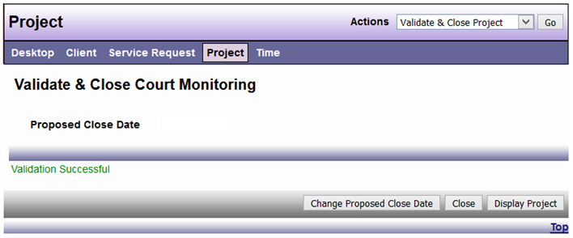

# Close a Project

There are three steps that must be complete before a Project is closed in DAD:

Step 1: Choose Prepare Project for Closings from Actions menu.

Step 2: Enter a proposed close date, then click “Save & Answer Closing Data

Step 3: Answer all of the closing questions

*Note: Different project types will have different questions. Once you have answered all of the questions, click “Save & Validate for closing” button.*

