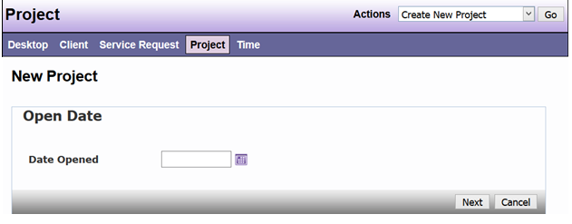
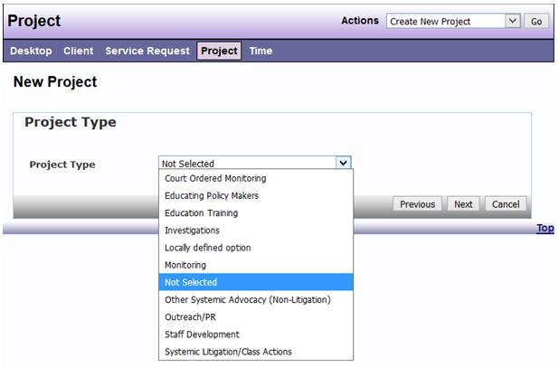
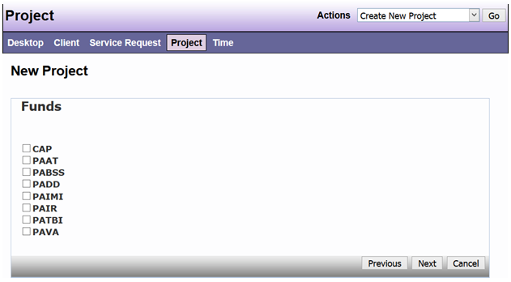
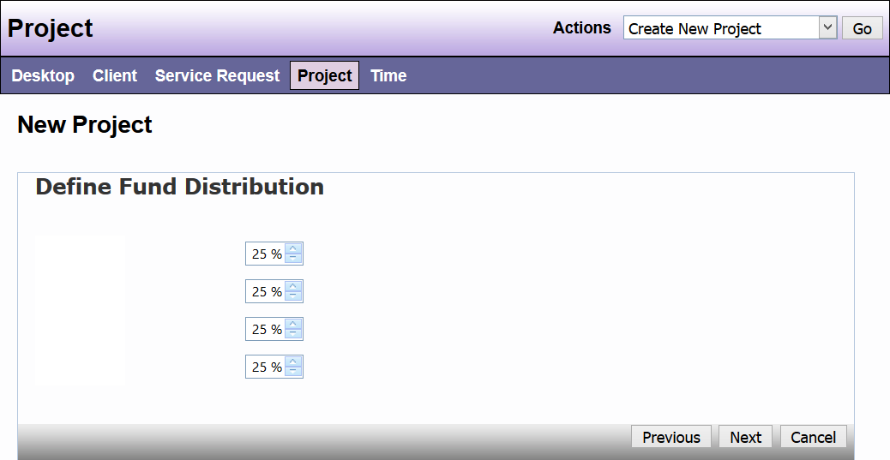
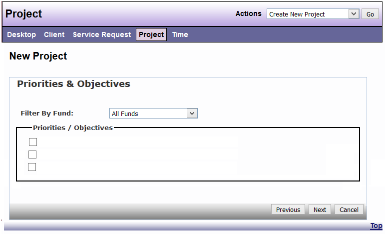
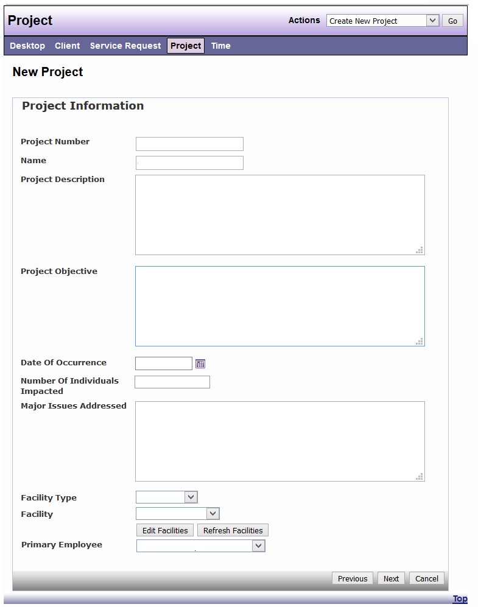

# New Project

Step 1: Open Date

 
Step 2: Select Project Type

 
*Note: Additional Project Types may appear based on agencies settings.*

Step 3: Select funding sources for Project

 
Note: Additional Project Types may appear based on agencies settings.  
 
Step 4:  Define Project Fund Distribution

 
Note: Project funding can be distributed across multiple projects, but the total distribution must equal 100% 

Step 5: Establish Project Priorities and Objectives

*Note: Projects may be connected to more than one priorities / objectives*

Step 6: Project Information

