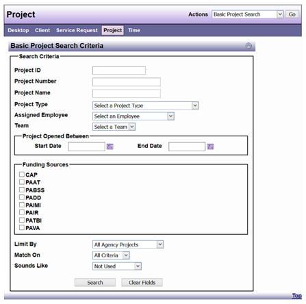

# Project Search

Basic Project Search allows you to search for Projects that have been created in DAD with many options to search by. It can be accessed on your Desktop if you choose to display it in User Preferences. It can also be accessed under “Tasks” in the “Actions” drop-down menu when in Desktop or Project view.

Advanced Project Search can be accessed when in DAD Desktop or Project views under “Tasks” in the “Actions” drop-down menu.  It has a few more options for search criteria.

