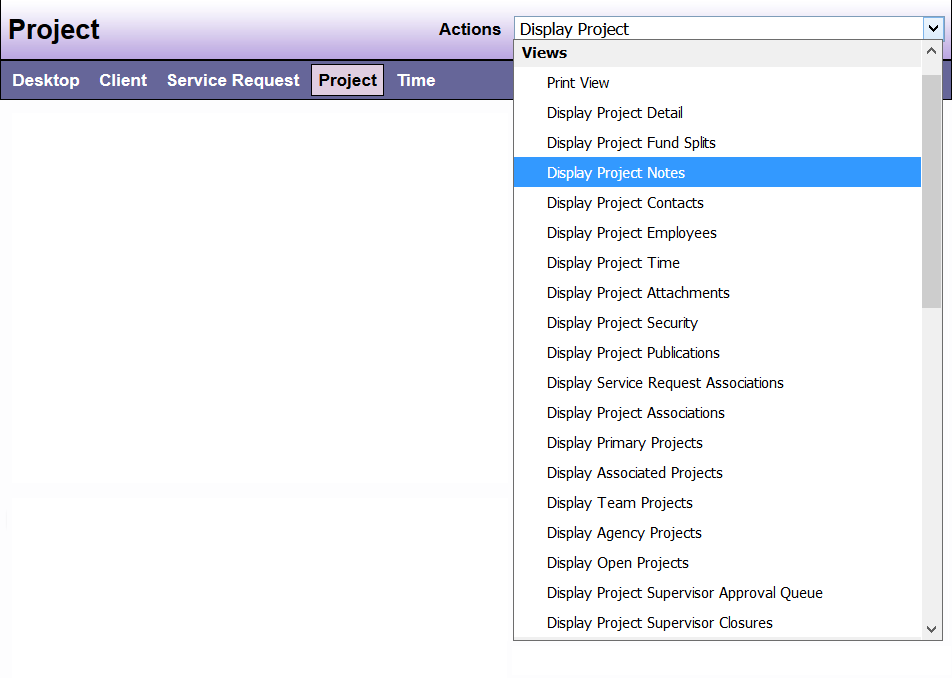

# Project View

The Project View displays information about the Project, assigned employees, Project contacts, and associated Service Requests. You can see your choice of all, or the last 5, the last 10, or the last 15 notes written about that Project. You also can see your choice of all, or the last 5, the last 10, or the last 15 Record Time entries for that Project.

You can access the Project View four ways:

1. By choosing a specific Project from the list on your Desktop 

2. By left clicking the Project link from any DAD window (which takes you to the last Project you viewed)

3. By choosing Display Primary, Associated, Team, or Agency Projects from the Desktop Actions dropdown.

4. By choosing Basic or Advanced Project search from the Desktop Tasks dropdown

You have the following options under the “Actions” drop-down menu when in the Projects view. 

