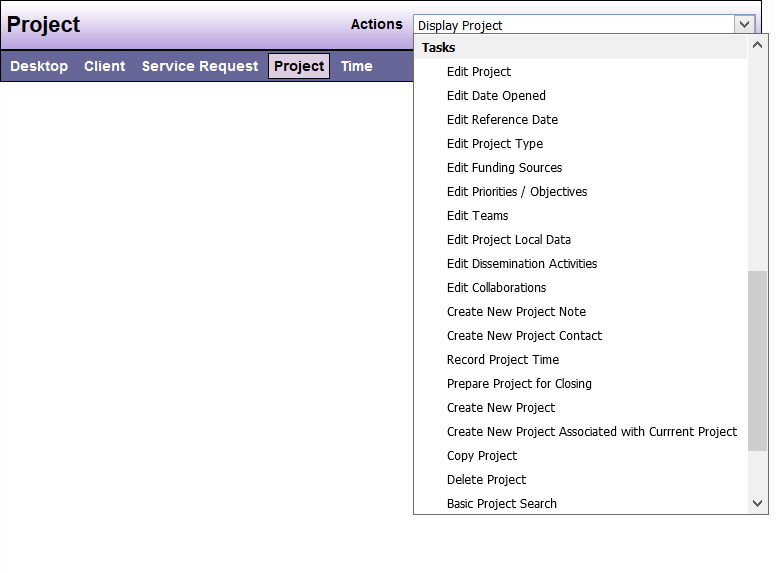

# Tasks

| Options | Feature Description |
|---------|---------------------|
| Edit Project | Enables you to edit many of the Project information fields such as the Project Name or Objective |
| Edit Date Opened | Enables you to edit the date in which the Project was opened |
| Edit Reference Date | Enables you to edit the reference date* for the Project |
| Edit Project Type | Enables you to edit the DAD Project Type |
| Edit Funding Sources | Enables you to edit the Funding Sources for the Project |
| Edit Priorities/Objectives | Enables you to edit the Priorities and/or Objectives for the Project |
| Edit Teams | Enables you to edit the Teams assigned to the Project |
| Edit Project Request Local Data | Enables you to edit fields set up locally |
| Edit Issues/Barriers Addressed | Enables you to edit the Issues/Barriers chosen for the Project (if any) |
| Edit Dissemination Activities | Enables you to edit how information was disseminated |
| Create New Project Note | Enables you to create a new Note for the Project |
| Create New Project Contact | Enables you to add a new Contact for the Project |
| Record Project Time | Enables you to Record Time you spend working on the Project |
| Prepare Project for Closing | Guides you through the process for closing a Project by completing the required fields |
| Create New Project | Allows you to create a new Project |
| Create New Project Associated with Current Project | Allows you to create a new Project and associate it with the current Project |
| Copy Project | Allows you to create a new Project and copies all details for the current project |
| Delete Project | Enables you to delete a Project |
| Basic Project Search | See previous Desktop Actions section |
| Advanced Project Search | See previous Desktop Actions section |
| Print | Allows you to print the current screen |

```admonish note
The **Reference Date** is the date the Project was originally created. DAD fields will be limited to the options available on that date. In order to have the current DAD fields and options, the reference date must be edited to the current date.
```

```admonish note
You may not have all of these options depending on your DAD security level.
```

**Sample View**:

