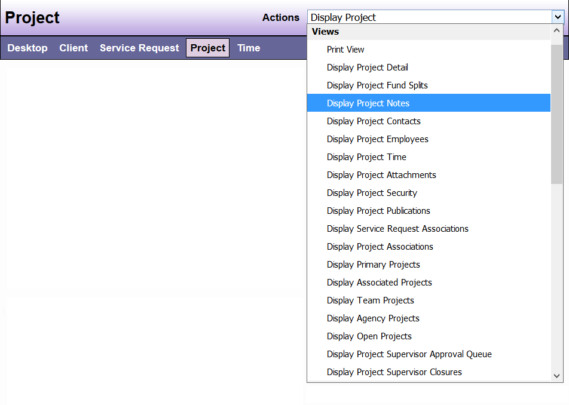

# Views


| Options | Feature Description |
|---------|---------------------|
| Print View | Displays all of the information entered in the Project |
| Display Project Summary | Displays limited information about the Project |
| Display Project Detail | Displays detailed information about the Project |
| Display Project Fund Splits | Displays the Fund Splits for recording time in the Project |
| Display Project Notes | Displays all, or the last 5, 10, or 15 notes for the Project |
| Display Project Contacts | Displays all contacts connected to the Project |
| Display Project Employees | Displays all employees connected to the Project (whether primary or associated) |
| Display Project Time | Displays all, or the last 5, 10, or 15 Record Time entries recorded for the Project |
| Display Project Security | Displays the DAD security groups with permission to view the Project |
| Display Project Publications | Displays all Publications that have been recorded in the Project |
| Display Service Request Associations | Displays open, closed, or all Associated Service Requests connected to the Project |
| Display Project Associations | Displays all, open, or closed Associated Projects connected to the Project |
| Display Primary Projects | Displays all, open, or closed Primary Projects assigned to the user depending on which option you choose from the drop down menu |
| Display Associated Projects | Displays all, open, or closed Associated Projects assigned to the user depending on which option you choose from the drop down menu |
| Display Team Projects | Displays open, closed, or all Team Projects for teams which the user is assigned to depending on which option you choose from the drop-down menu |
| Display Agency Projects | Displays open, closed, or all Agency Projects depending on which option you choose from the drop-down menu |

```admonish note
When displaying Primary, Associated, Team, or Agency Projects, the last choice you make in the available drop down menu (all, open, or closed) is what will appear each time you are on your Desktop until you choose another option.
```

**Sample View**:

