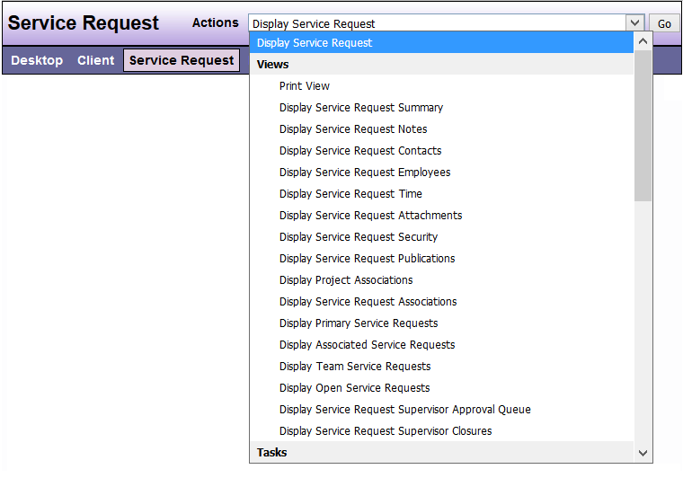

# Service Request

The methodology for using the DAD application is that advocacy efforts from an agency for an individual are recorded as a Service Request associated with a Client. Advocacy efforts from an agency for a group of individuals, training or outreach activities, or other administrative Projects are recorded as Projects.

The following options are available under the “Actions” menu when in the Service Request View.

