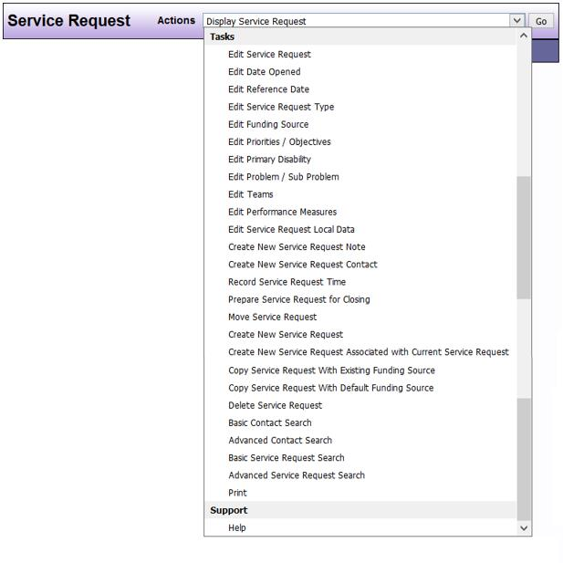

# Tasks

| Options | Feature Description |
|---------|---------------------|
| Edit Service Request | Enables you to edit many of the Service Request information fields such as the Eligibility or Client Objective 
| Edit Date Opened | Enables you to edit the date in which the Service Request was opened |
| Edit Reference Date | Enables you to edit the reference date for the Service Request |
| Edit Service Request Type | Enables you to edit the DAD Service Request Type |
| Edit Funding Source | Enables you to edit the Funding Source for the Service Request |
| Edit Service Request Type | Enables you to edit the DAD Service Request Type |
| Edit Priorities/Objectives | Enables you to edit the Priorities and/or Objectives for the Service Request. |
| Edit Primary Disability | Enables you to edit the Primary Disability for the Service Request and explain the Primary Disability if required |
| Edit Problem/Sub Problem | Enables you to edit the Problem and/or Sub Problem for the Service Request |
| Edit Teams | Enables you to edit the Teams connected to the Service Requests |
| Edit Service Request Local Data | Enables you to edit fields set up by local administrators such as type of SSA benefit |
| Create New Service Request Note | Enables you to create a new Note for the Service Request |
| Create New Service Request Contact | Enables you to create a new Contact for the Service Request |
| Record Service Request Time | Enables you to Record Time you spend working on the Service Request |
| Prepare Service Request for Closing | Guides you through the process for closing a Service Request by completing the required fields |
| Answer Closing Data | Once you have chosen Prepare Service Request for Closing but have not yet closed the Service Request, you will see this option that you can use to add or edit closing data |
| Validate and Close Service Request | Once you have chosen Prepare Service Request for Closing and have answered the closing data but have not yet closed the Service Request, you will see this option to close the Service Request |
| Move Service Request | Allows you to move the Service Request to another Client. Contact your DAD Administrator for assistance |
| Create New Service Request | Allows you to create a new Service Request for the Client |
| Create New Service Request Associated with Current Service Request | Allows you to create a new Service Request for the Client and associate it with the current Service Request |
| Copy Service Request with Existing Funding Source | Allows you to create a new Service Request for the Client and copies the details from the current Service Request including the funding source |
| Copy Service Request with Default Funding Source | Allows you to create a new Service Request for the Client and copies the details from the current Service Request but uses the default funding source |
| Delete Service Request | Enables you to delete a Service Request. (Dependent on security permissions.) |
| Basic Contact Search | See previous Desktop Actions section |
| Advanced Contact Search | See previous Desktop Actions section. |
| Basic Service Request Search | See previous Desktop Actions section. |
| Advanced Service Request Search | See previous Desktop Actions section. |
| Print | Allows you to print the current screen |

```admonish note
The **Reference Date** is the date the Service Request was originally created. DAD fields will be limited to the options available on that date. In order to have the current DAD fields and options, the reference date must be edited to the current date. Contact the your DAD Administrator for assistance.
```

**Sample View**:

