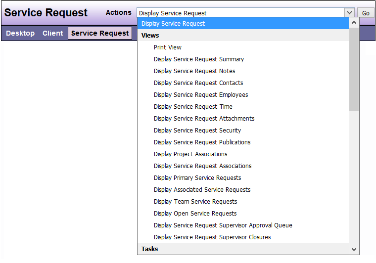

# Views

| Options | Feature Description |
|---------|---------------------|
| Print View | Displays all data for the Service Request, including notes, Record Time entries and information about the adversary and referrer. |
| Display Service Request Summary | Displays limited information about the Service Request |
| Display Service Detail | Displays detailed information about the Service Request[^note] | 
| Display Service Request Notes | Displays all, or the last 5, 10, or 15 notes related to the Service Request depending on how you set up your Service Request view |
| Display Service Request Contacts | Displays all of the Client Contacts related to the Service Request. |
| Display Service Request Employees | Displays all Employees assigned to the Service Request (whether primary or associated) |
| Display Service Request Time | Displays all, or the last 5, 10, or 15 Record Time entries recorded for the Service Request depending on how you set up your Service Request view. |
| Display Service Request Security | Displays the DAD security groups with permission to view the Service Request
| Display Service Request Publications | Displays the Publications that have been recorded in the Service Request |
| Display Project Associations | Displays all DAD Projects associated with the Service Request |
| Display Service Request Associations | Displays all DAD Service Requests associated with the Service Request 
| Display Primary Service Requests | Displays open, closed, or all Primary Service Requests assigned to the user depending option you choose from the drop down menu |
| Display Associated Service Requests | Displays open, closed, or all Associated Service Requests assigned to the user depending on option you choose from the drop down menu |
| Display Team Service Requests | Displays open, closed, or all Team Service Requests assigned to the user. |

```admonish note
When displaying Primary or Associated Service Requests, the last choice you make in the available drop down menu (all, open, or closed) is what will appear each time you are on your Desktop until you choose another option.
```

**Sample View**:



---

[^note]: see the below note

```admonish note
Depending on which Service Request view you are in, you will see one or the other of the two options in the drop-down “Actions” menu.```