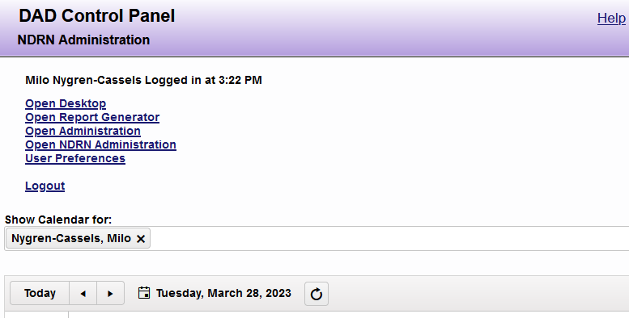
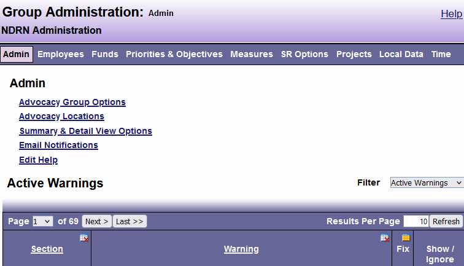
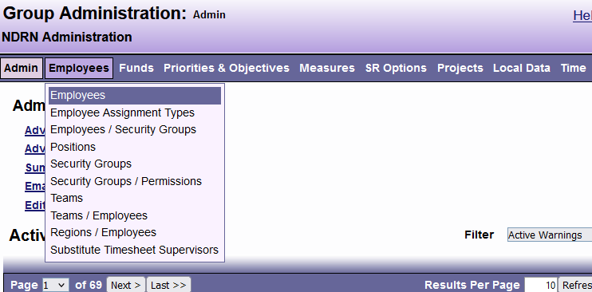
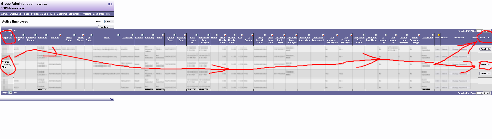

# I am a DAD Admin and I want to reset a user's 2FA

Some DAD 2FA problems are best resolved by resetting the user's 2FA settings and then having them set up the authenticator again. A local DAD administrator must do the resetting. Pretty much all 2FA issues can be resolved by doing this.

Here is how to reset their 2fa settings:

1. log in on an account with admin powers

2. go to Open Administration

3. open the employees dropdown

4. then go to the Employees page...

You should be at a table listing all the users. The last column of this table, Reset 2fa, has a reset button for each user.

5. ...and reset the settings for the user

Click the user's button, then click "ok" when asked to confirm

You're all done! Now the user should try to log in again, and this time they'll be shown the 2FA setup screen.